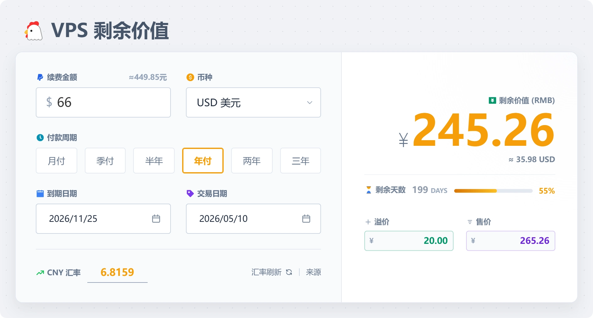
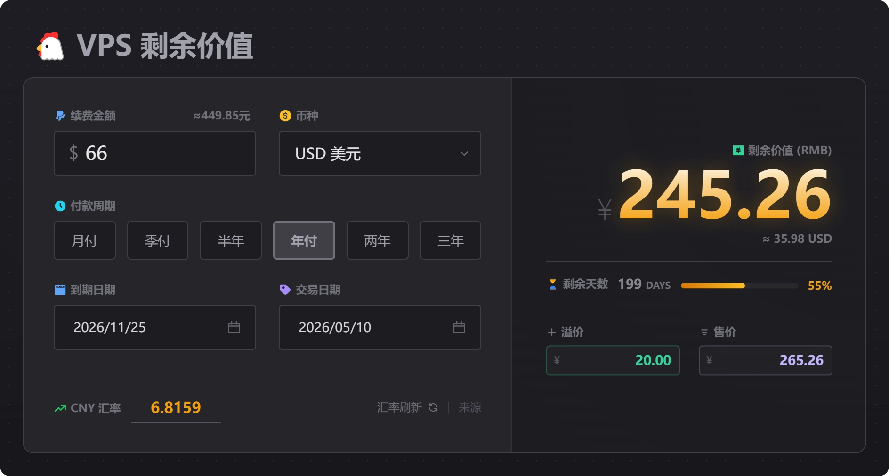

这是一个简单美观的 VPS 剩余价值计算器，支持多种货币、自定义汇率，并可以生成精美的分享图片。





✨ **特性**：
- 💰 支持多币种自动汇率转换 (USD, EUR, GBP, JPY 等)
- 📅 自动计算剩余天数和金额
- 🎨 支持深色/浅色模式切换
- 🖼️ **一键生成交易卡片图片** (纯前端生成，无隐私泄露)
- 📱 适配移动端和 PC 端

---


## 🚀 部署

### Cloudflare Pages / Vercel / EdgeOne Pages

本项目是纯静态网站，支持直接部署到任何静态托管平台。

- **构建命令**: `npm run build`
- **输出目录**: `dist`

### Cloudflare Workers

已配置 `wrangler.toml`，支持通过 Workers 部署静态资源：

```bash
npx wrangler deploy
```
#### 一键 Cloudflare 部署：

[](https://deploy.workers.cloudflare.com/?url=https://github.com/wuyangdaily/vps)

## 🛠️ 开发与构建

本项目使用 Vite + Tailwind CSS 构建。

1. 安装依赖：
   ```bash
   npm install
   ```

2. 启动本地开发服务器：
   ```bash
   npm run dev
   ```

3. 构建生产环境代码（生成 `dist/` 目录）：
   ```bash
   npm run build
   ```

---

## 📝 许可证
Apache-2.0 License
